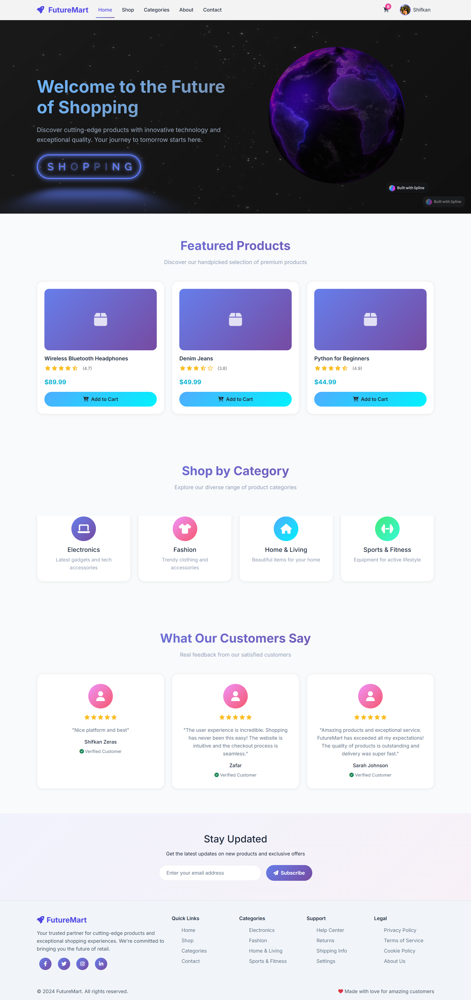
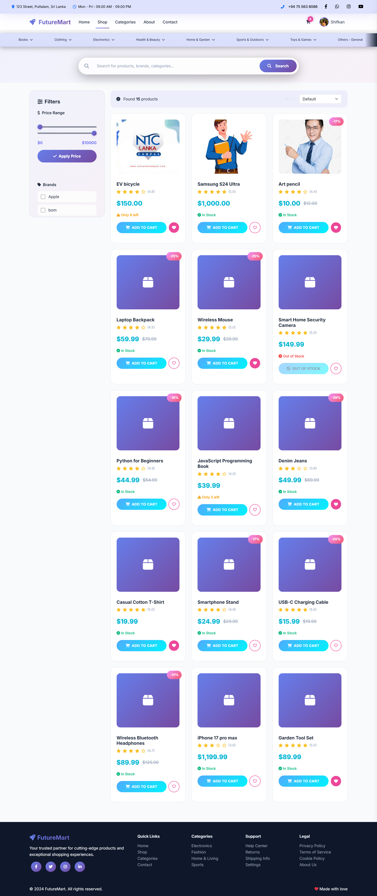
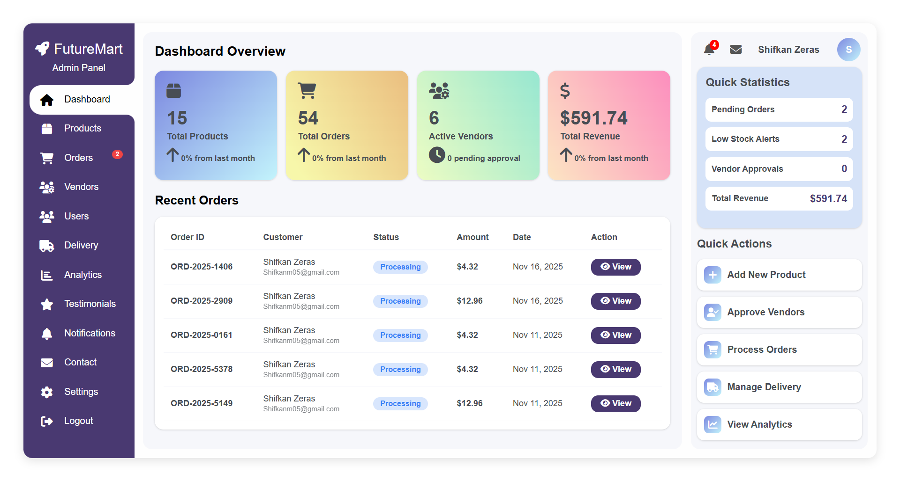
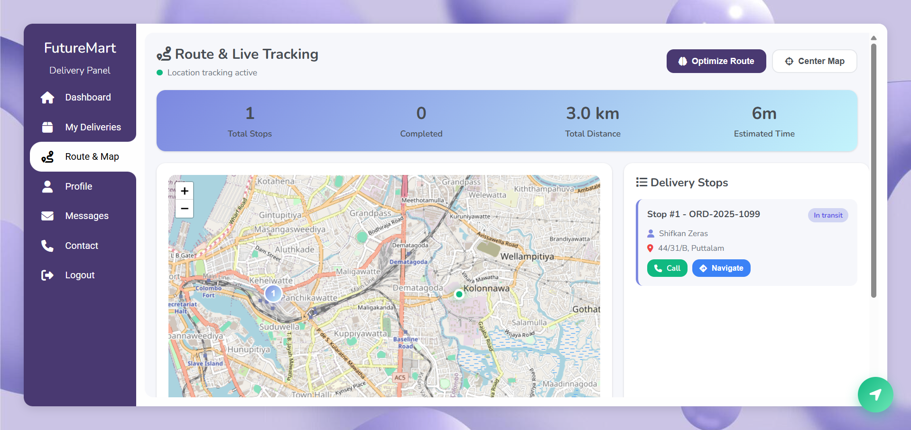

# 🛒 Multi-Vendor E-Commerce Platform (FutureMart)

A comprehensive **Multi-Vendor E-Commerce System** built from scratch using **Core PHP**. This platform allows multiple vendors to sell products, users to purchase, and admins to manage the entire ecosystem effectively.

It features a robust **Role-Based Access Control (RBAC)** system with four distinct user modules.

## 📸 Project Screenshots

| **Home Page** | **Products Page** |
|:---:|:---:|
|  |  |

| **Admin Dashboard** | **Delivery Route** |
|:---:|:---:|
|  |  |

*(Note: These screenshots represent the actual working interface of the application.)*

## 🚀 Key Features

### 👤 1. User Module (Customer)
- **Browse Products:** View products by category, price, and vendor.
- **Cart & Wishlist:** Add products to cart and wishlist seamlessly (AJAX-based).
- **Checkout System:** Secure checkout with order summary.
- **Order Tracking:** Track order status (Pending, Shipped, Delivered).

### 🏪 2. Vendor Module (Seller)
- **Product Management:** Add, edit, and delete products.
- **Order Management:** View and process orders received for their products.
- **Sales Reports:** View daily/monthly sales performance.
- **Stock Management:** Manage inventory levels.

### 👑 3. Admin Module (Super Admin)
- **User & Vendor Management:** Approve or block vendors/users.
- **Category Management:** Add and manage product categories.
- **Platform Analytics:** View total sales, active vendors, and user statistics.
- **Commission System:** Manage platform commission settings.

### 🚚 4. Delivery Module
- **Order Assignment:** View orders assigned for delivery.
- **Status Updates:** Update order status (Out for Delivery, Delivered).

## 🛠️ Tech Stack
- **Backend:** Core PHP (Object-Oriented & Procedural)
- **Frontend:** HTML5, CSS3, JavaScript (AJAX for dynamic actions)
- **Database:** MySQL (Relational Database Design)
- **Security:** Session Management, Password Hashing, SQL Injection Protection.

## ⚙️ Installation & Setup (Localhost)

To run this project on your local machine, follow these steps:

1.  **Install XAMPP/WAMP:** Ensure you have a local server environment installed.
2.  **Clone the Repository:**
    ```bash
    git clone [https://github.com/Shifkan04/FutureMart-E-commerce-website.git](https://github.com/Shifkan04/FutureMart-E-commerce-website.git)
    ```
3.  **Move Files:** Copy the project folder to `htdocs` (XAMPP) or `www` (WAMP).
4.  **Database Setup:**
    * Open `phpMyAdmin` (http://localhost/phpmyadmin).
    * Create a new database named `futuremart_db` (or check `config.php`).
    * Import the `database.sql` file provided in the repository.
5.  **Configure:** Check `db_connect.php` or `config.php` to ensure database credentials match.
6.  **Run:** Open your browser and go to `http://localhost/FutureMart-E-commerce-website/`.

## 📂 Folder Structure
/FutureMart-E-commerce-website │ ├── /admin # Admin panel files (Dashboard, User/Vendor management) │ ├── index.php # Admin login │ ├── dashboard.php # Admin home │ └── ... │ ├── /vendor # Vendor panel files (Product upload, Order view) │ ├── login.php # Vendor login │ ├── products.php # Manage products │ └── ... │ ├── /assets # Static assets (CSS, JS, Images, Fonts) │ ├── /css # Stylesheets │ ├── /js # JavaScript files (AJAX, Validations) │ └── /images # Site logos and icons │ ├── /includes # Reusable PHP components (Header, Footer, DB Connect) │ ├── db_connect.php # Database connection file │ ├── header.php # Common navigation bar │ └── footer.php # Common footer │ ├── /uploads # Product images uploaded by vendors │ ├── /sql # Database SQL file │ └── database.sql # Import this file to phpMyAdmin │ ├── index.php # Landing page (Home) ├── product.php # Product details page ├── cart.php # Shopping cart logic ├── checkout.php # Checkout process └── README.md # Project documentation
---
**Author:** Jaroof Deen Shifkan  
[LinkedIn](https://www.linkedin.com/in/shifkan/) | [GitHub](https://github.com/shifkan04)

